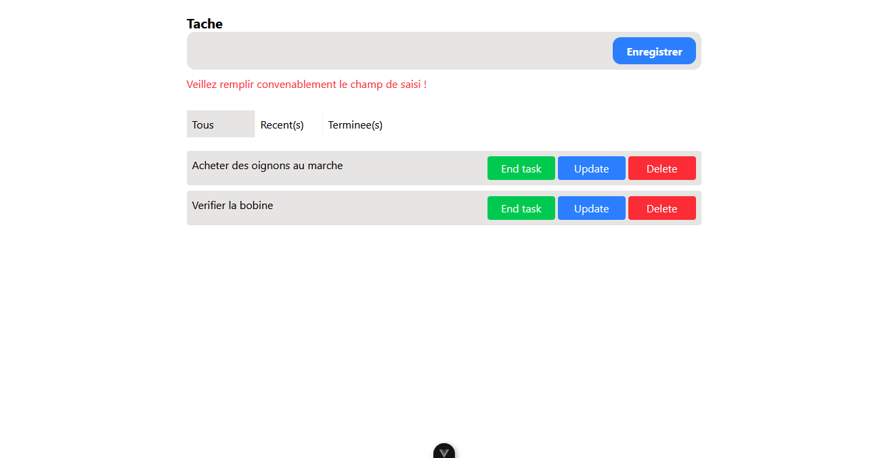

# vue-project-todoList



## Description

Petite application de todolist pour gerer ses taches ecrite en Vuejs et tailwindcss

## Commencer

```sh
npm install
```

### Compile and Hot-Reload for Development

```sh
npm run dev
```

### Compile and Minify for Production

```sh
npm run build
```

